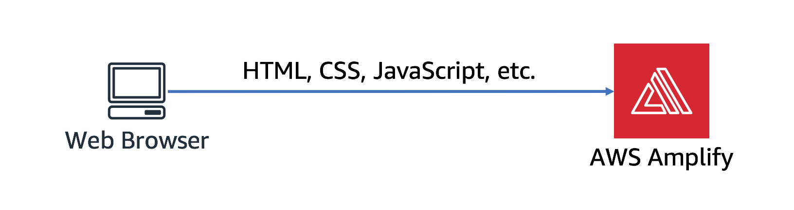
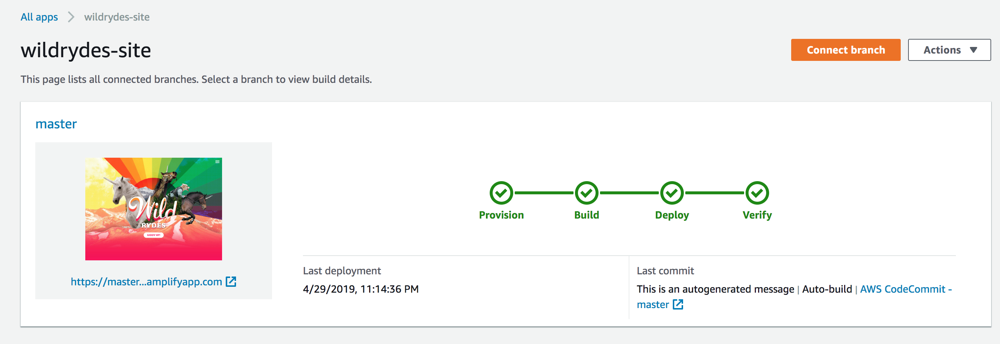
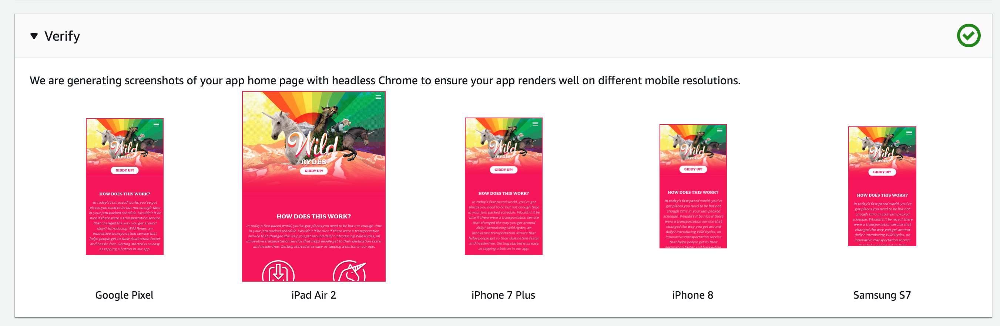

# Module 1: Static Web Hosting with AWS Amplify Console

In this module I will guide you and show how to configure AWS Amplify Console to host the static resources for your web application. In subsequent modules I will showcase how to add dynamic functionality to these pages using JavaScript to call remote RESTful APIs built with AWS Lambda and Amazon API Gateway.

## Architecture Overview

The architecture for this module is very straightforward. All of the static web content including HTML, CSS, JavaScript, images and other files will be managed by AWS Amplify Console and served via Amazon CloudFront. The end users will then access the site using the public website URL exposed by AWS Amplify Console. 



## Implementation Instructions

In the following sections, I have given an implementation overview and detailed, step-by-step instructions. This overview should provide enough context on how the to  the implementation was completed.

### Region Selection

This project  can be deployed in any AWS region that supports the following services:

- AWS Amplify Console
- AWS CodeCommit

You can refer to the [AWS region table][region-services] in the AWS documentation to see which regions have the supported services. Among the supported regions you can choose are:
* North America: N. Virginia, Ohio, Oregon
* Europe: Ireland, London, Frankfurt
* Asia Pacific: Tokyo, Seoul, Singapore, Sydney, Mumbai

Here I have selected **US East(N. Virginia)**. But a differnt region can also be selected.


### Create the git repository
Use [AWS CodeCommit][commit] and [GitHub][github] to host your site's repository. Note that [CodeCommit][codecommit-free] is available as part of free tier account.


#### Github Step
**Step-by-step Instructions**
1. Follow the instructions on [GitHub][github] to [Create a repository][create-repo]. For now just create the repository.
1. Clone the repository locally using your GitHub credentials, please refer the following
    1. Reference 1- [Generating a new SSH key and adding it to the ssh-agent][github-new-sshkey]
    1. Referenec 2- [Clone the repository][github-clone]

#### Populate the git repository
Once your git repository is created and cloned locally, you'll need to pull in the files for your website and sync them up to the repository. 

**Step-by-step Instructions**
From your Cloud9 development environment(or local environment)
1. Change directory into your repository:
    ```
    cd wildrydes-site/
    ```
1. Copy the files from S3:
    ```
    aws s3 cp s3://wildrydes-us-east-1/WebApplication/1_StaticWebHosting/website ./ --recursive
    ```
1. Commit the files to your git service  enter an email and user name for the commit:
    ```
    $ git add .
    $ git config --global user.email "<EMAIL ADDRESS>"
    $ git config --global user.name "<USER NAME>"
    $ git commit -m "initial checkin of website code"
    $ git push
    
    Username for 'https://git-codecommit.us-east-1.amazonaws.com': wildrydes-codecommit-at-xxxxxxxxx
    Password for 'https://wildrydes-codecommit-at-xxxxxxxxx@git-codecommit.us-east-1.amazonaws.com': 
    Counting objects: 95, done.
    Compressing objects: 100% (94/94), done.
    Writing objects: 100% (95/95), 9.44 MiB | 14.87 MiB/s, done.
    Total 95 (delta 2), reused 0 (delta 0)
    To https://git-codecommit.us-east-1.amazonaws.com/v1/repos/wildrydes-site
     * [new branch]      master -> master
    ```

### Deploy the site with the AWS Amplify Console
Next use the [AWS Amplify Console][amplify-console] to deploy the website that is just commited to git. The Amplify Console takes care of the work of setting up a place to store the static web application code and provides a number of helpful capabilities to simplify both the lifecycle of that application as well as enable best practices.

**Step-by-step directions**
1. Launch the [Amplify Console console page][amplify-console-console]
1. Click **Connect App**
1. Select the *Repository service provider* used today and select **Next**
    1. As we have used GitHub, we need to authorize AWS Amplify to the GitHub account used
1. From the dropdown select the *Repository* and *Branch* created 
    
    
1. On the "Configure build settings" page leave all the defaults and select **Next**
1. On the "Review" page select **Save and deploy**
    
    The process takes a couple of minutes for Amplify Console to create the neccesary resources and to deploy code.
    
    

Once completed, click on the site image to launch Wild Rydes site.


If you click on the link for *Master* review various pieces of information about your website deployment, including sample renderings on various platforms:



### Modify the website
The AWS Amplify Console rebuilds and redeploys the app when it detects changes to the connected repository. Here make a change to the main page so as to test out this process.

**Step-by-step Instructions**
1. From Cloud9 environment open the ```index.html``` file in the root directory of the repository.
1. Modify the title line:
    ```
      <title>Wild Rydes</title>
    ```
    And change it to:
    ```
      <title>Wild Rydes - Rydes of the Future!</title>
    ```
    Save the file
1. Commit again to the git repository:
    ```
    $ git add index.html 
    $ git commit -m "updated title"
    [master dfec2e5] updated title
     1 file changed, 1 insertion(+), 1 deletion(-)
    
    $ git push
    Counting objects: 3, done.
    Compressing objects: 100% (3/3), done.
    Writing objects: 100% (3/3), 315 bytes | 315.00 KiB/s, done.
    Total 3 (delta 2), reused 0 (delta 0)
    remote: processing 
    To https://git-codecommit.us-east-1.amazonaws.com/v1/repos/wildrydes-site
       2e9f540..dfec2e5  master -> master
   ```
    Amplify Console will begin to build the site again soon after it notices the update to the repository. Head back to the [Amplify Console console page][amplify-console-console] to monitor the process. 

1. Once completed, re-open the Wild Rydes site and review the title change.
    
    

### : Recap

The purpose of this module was to show the applications and effectiveness of the AWS Amplify console along with showcasing S3, and GitHub support provide by AWS.
In retrospective, AWS Amplify Console makes it really easy to deploy static websites following a continuous integration and delivery model. It has capabilities for "building" more complicated javascript framework based applications and can show you a preview of your application as it would rendor on popular mobile platforms.

Thus in this module, we have showcased the ASW amplify capabilitues by creating a static website which will be the base for the Wild Rydes business.

### Next

In the next module, [User Management][user-management], 
we will configure Amazon Cognito User Pools to manage the users for our application.

[setup]: ../0_Setup/
[commit]: https://aws.amazon.com/codecommit
[github]: https://github.com
[iam-console]: https://console.aws.amazon.com/iam/home
[codecommit-free]: https://aws.amazon.com/codecommit/pricing/
[codecommit-console]: https://console.aws.amazon.com/codesuite/codecommit/repositories
[create-repo]: https://help.github.com/en/articles/create-a-repo
[github-new-sshkey]: https://help.github.com/en/articles/generating-a-new-ssh-key-and-adding-it-to-the-ssh-agent
[github-clone]: https://help.github.com/en/articles/cloning-a-repository
[amplify-console]: https://aws.amazon.com/amplify/console/
[amplify-console-console]: https://console.aws.amazon.com/amplify/home
[user-management]: ../2_UserManagement/
[region-services]: https://aws.amazon.com/about-aws/global-infrastructure/regional-product-services/
