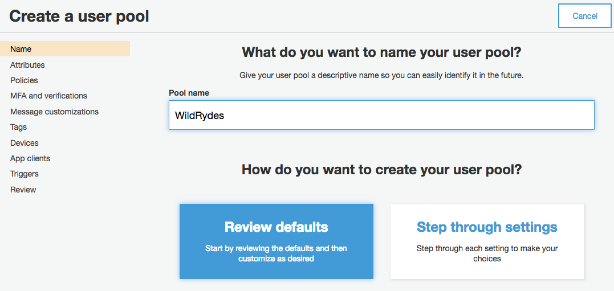
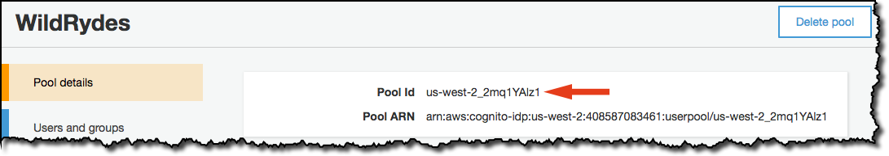
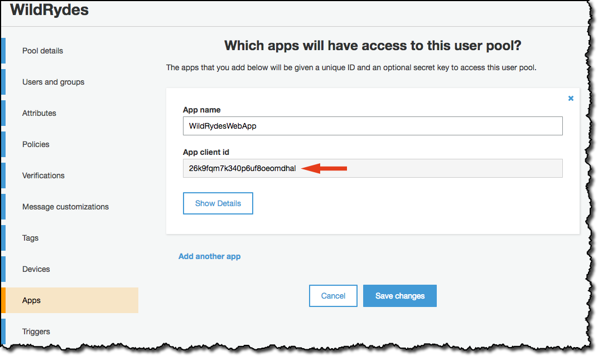

# Module 2: User Authentication and Registration with Amazon Cognito User Pools

In this module we'll create an [Amazon Cognito][cognito] user pool to manage the users' accounts. We'll deploy pages that enable customers to register as a new user, verify their email address, and sign into the site.

## Architecture Overview

When users visit the website they will first register a new user account. For the purposes of this workshop we'll only require them to provide an email address and password to register. However, we can configure Amazon Cognito to require additional attributes in our own applications.

After users submit their registration, Amazon Cognito will send a confirmation email with a verification code to the address they provided. To confirm their account, users will return to your site and enter their email address and the verification code they received.User confirmation can also be done by using the Amazon Cognito console, this suits perfectly as we can use fake email addresses for testing.

After users have a confirmed account (either using the email verification process or a manual confirmation through the console), they will be able to sign in. When users sign in, they enter their username (or email) and password. A JavaScript function then communicates with Amazon Cognito, authenticates using the Secure Remote Password protocol (SRP), and receives back a set of JSON Web Tokens (JWT). The JWTs contain claims about the identity of the user and will be used in the next module to authenticate against the RESTful API you build with Amazon API Gateway.


## Implementation Instructions

Each of the following sections provides an implementation overview and detailed, step-by-step instructions. The overview should provide enough context to complete the implementation.

### 1. Create an Amazon Cognito User Pool

#### Background

Amazon Cognito provides two different mechanisms for authenticating users. We can use Cognito User Pools to add sign-up and sign-in functionality for our application or use Cognito Identity Pools to authenticate users through social identity providers such as Facebook, Twitter, or Amazon, with SAML identity solutions, or by using our own identity system. For this module we'll use a user pool as the backend for the provided registration and sign-in pages.

Use the Amazon Cognito console to create a new user pool using the default settings. Once the pool is created, note the Pool Id. As we need this value later.

**Step-by-step directions**

1. Go to the [Amazon Cognito Console][cognito-console]
1. Choose **Manage your User Pools**.
1. Choose **Create a User Pool**
1. Provide a name for the user pool as `WildRydes`, then select **Review Defaults**
    
1. On the review page, click **Create pool**.
1. Note the **Pool Id** on the Pool details page of your newly created user pool.

### 2. Add an App Client to Your User Pool

From the Amazon Cognito console select the user pool and then select the **App clients** section. Add a new app and make sure the Generate client secret option is deselected.This is done because Client secrets aren't supported with the JavaScript SDK. 

**Step-by-step directions**
1. From the Pool Details page for your user pool, select **App clients** from the **General settings** section in the left navigation bar.
1. Choose **Add an app client**.
1. Give the app client a name such as `WildRydesWebApp`.
1. **Uncheck** the Generate client secret option. Client secrets aren't supported for use with browser-based applications.
1. Choose **Create app client**.
   <kbd></kbd>
1. Note the **App client id** for the newly created application.

### 3. Update the config.js File in Your Website

The [/js/config.js][configjs] file contains settings for the user pool ID, app client ID and Region. Update this file with the settings from the user pool and app created in the previous steps and commit the file back to your git repository.

**Step-by-step directions**
1. On the Cloud9 development environment open `js/config.js`
1. Update the `cognito` section with the correct values for the user pool and app we just created.
    To the value for `userPoolId` on the Pool details page of the Amazon Cognito console, select the user pool that you created.

    

    Find the value for `userPoolClientId` by selecting **App clients** from the left navigation bar. Use the value from the **App client id** field for the app that we have created in the previous section.

    

    The value for `region` should be the AWS Region code where we have created your user pool. here we are using `us-east-1` for the N. Virginia Region  To use any alternate codes, refer the Pool ARN value on the Pool details page. The Region code is the part of the ARN immediately after `arn:aws:cognito-idp:`.

    The updated config.js file looks like this:
    ```JavaScript
    window._config = {
        cognito: {
            userPoolId: 'us-west-2_uXboG5pAb', // e.g. us-east-2_uXboG5pAb
            userPoolClientId: '25ddkmj4v6hfsfvruhpfi7n4hv', // e.g. 25ddkmj4v6hfsfvruhpfi7n4hv
            region: 'us-west-2' // e.g. us-east-2
        },
        api: {
            invokeUrl: '' // e.g. https://rc7nyt4tql.execute-api.us-west-2.amazonaws.com/prod,
        }
    };
    ```
1. Save the modified file with filename is still `config.js`.
1. Commit the changes to the added git repository:
    ```
    $ git add js/config.js 
    $ git commit -m "configure cognito"
    $ git push
    ...
    Counting objects: 4, done.
    Compressing objects: 100% (4/4), done.
    Writing objects: 100% (4/4), 415 bytes | 415.00 KiB/s, done.
    Total 4 (delta 3), reused 0 (delta 0)
    To https://git-codecommit.us-east-1.amazonaws.com/v1/repos/wildrydes-site
       7668ed4..683e884  master -> master
    ```

    Amplify Console picks up the changes and begins building and deploying the web application.

**Note:** Instead of having writing the the browser-side code for managing the registration, verification, and sign in flows, we have imported a working implementation in the assets you deployed in the first module. The [cognito-auth.js](../1_StaticWebHosting/website/js/cognito-auth.js) file contains the code that handles UI events and invokes the appropriate Amazon Cognito Identity SDK methods. For more information about the SDK, refer to the [project page on GitHub](https://github.com/aws/amazon-cognito-identity-js).

## Implementation Validation

**Step-by-step directions**
1. Visit `register.html` under the website domain, or choose the **Giddy Up!** button on the homepage of site we have deployed.

1. Complete the registration form and choose **Let's Ryde**. We can use your own email or enter a fake email. Make sure to choose a password that contains at least one upper-case letter, a number, and a special character. You should see an alert that confirms that your user has been created.

1. Confirm a new user using one of the two following methods.

  1. If a valid email is used, account verification process can be completed by visiting `/verify.html` under the website domain and entering the verification code that is emailed to you. Quick note, the verification email can end up in spam folder. It is recommende to use [configuring your user pool to use Amazon Simple Email Service](http://docs.aws.amazon.com/cognito/latest/developerguide/cognito-user-pool-settings-message-customizations.html#cognito-user-pool-settings-ses-authorization-to-send-email) to send emails from a domain to a valid email address.

1. Here use a dummy email and confirm that email using Cognito.

    1. From the AWS console, click Services then select **Cognito** under Security, Identity & Compliance.
    1. Choose **Manage your User Pools**
    1. Select the `WildRydes` user pool and click **Users and groups** in the left navigation bar.
    1. Here we see the dummy email address and the user details we have used. Choose that username to view the user detail page.
    1. Choose **Confirm user** to finalize the account creation process.

1. After confirming the new user using either the `/verify.html` page or the Cognito console, visit `/signin.html` and logging in using the email address and password.
1. We see that it is redirected to `/ride.html`. A notification is their that says the API is not configured.

    

### Module Recap

In this module we have succefully showcased the working of amazon Cognito.
In summery, Amazon Cognito provides two different capabilities for managing users, federated identities and user pools. [Amazon Cognito][cognito] user pools can handle almost every aspect about managing users, their login credentials, handling password resets, multifactor authentication and much more!

In this module we've used user pools to create a completely hosted and managed user management system that will allow us to authenticate website users and manage their user information. From there we've updated the website to use the user pool and utlized the AWS SDKs to provide a signin form on the site.

### Next

Now in the next module, we will setup one of the main component of this project a [Serverless Backend][serverless-backend].

[static-web-hosting]: ../1_StaticWebHosting/
[amplify-console]: https://aws.amazon.com/amplify/console/
[cognito]: https://aws.amazon.com/cognito/
[setup]: ../0_Setup/
[serverless-backend]: ../3_ServerlessBackend/
[cognito-console]: https://console.aws.amazon.com/cognito/home
[configjs]: ../1_StaticWebHosting/website/js/config.js
[jwt-decoder]: https://jwt.io/
