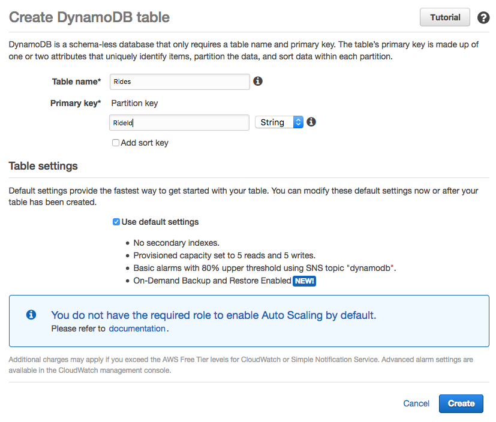
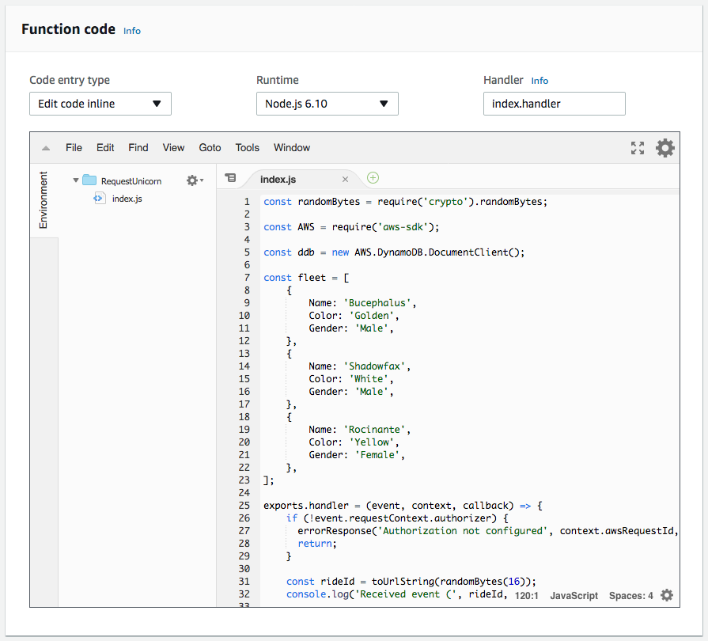

# Module 3: Serverless Service Backend

In this module we'll use [AWS Lambda][lambda] and [Amazon DynamoDB][dynamodb] to build a backend process for handling requests from web application we have build until now. The browser application that is deployed in the first module allows users to request that a unicorn be sent to a location of their choice. In order to fulfill those requests, the JavaScript running in the browser will need to invoke a service running in the cloud.

A Lambda function will be implemented that will be invoked each time a user requests a unicorn. The function will select a unicorn from the fleet, record the request in a DynamoDB table and then respond to the front-end application with details about the unicorn being dispatched.


The function is invoked from the browser using [Amazon API Gateway][api-gw]. We'll implement that connection in the next module. For this module we'll just test the function in isolation.

## Implementation Instructions

Each of the following sections provides an implementation overview and detailed, step-by-step instructions. The overview should provide enough context for to complete the implementation.

### 1. Create an Amazon DynamoDB Table

Use the Amazon DynamoDB console to create a new DynamoDB table. Call a table `Rides` and give it a partition key called `RideId` with type String. The table name and partition key are case sensitive. Make sure to use the exact IDs provided. Use the defaults for all other settings.

After the table has been created, note the ARN in the scrath pad on cloud9.

**Step-by-step directions**
1. Go to the [Amazon DynamoDB Console][dynamodb-console]
1. Choose **Create table**.
1. Enter `Rides` for the **Table name**. This field is case sensitive.
1. Enter `RideId` for the **Partition key** and select **String** for the key type. This field is also case sensitive.
1. Check the **Use default settings** box and choose **Create**.
    
1. Scroll to the bottom of the Overview section of a new table and note the **ARN**. This ARN is used in next section.

### 2. Create an IAM Role for Your Lambda function

#### Background

Every Lambda function has an IAM role associated with it. This role defines what other AWS services the function is allowed to interact with. For the purposes of this project, we'll need to create an IAM role that grants the Lambda function we created a permission to write logs to Amazon CloudWatch Logs and access to write items to DynamoDB table created.

#### High-Level Instructions

Use the IAM console to create a new role. Name it `WildRydesLambda` and select AWS Lambda for the role type. We'll need to attach policies that grant the function created the permissions to write to Amazon CloudWatch Logs and put items to your DynamoDB table.

Attach the managed policy called `AWSLambdaBasicExecutionRole` to this role to grant the necessary CloudWatch Logs permissions. Also, create a custom inline policy for a role that allows the `ddb:PutItem` action for the table created in the previous section.

**Step-by-step directions**
1. Go to the [AWS IAM Console][iam-console]
1. Select **Roles** in the left navigation bar and then choose **Create role**.
1. Select **Lambda** for the role type from the **AWS service** group, then click **Next: Permissions**
    **Note:** Selecting a role type automatically creates a trust policy for your role that allows AWS services to assume this role on our behalf. If we were creating this role using the CLI, AWS CloudFormation or another mechanism, we would specify a trust policy directly.
1. Begin typing `AWSLambdaBasicExecutionRole` in the **Filter** text box and check the box next to that role.
1. Click **Next: Tags**. Add tags.
1. Click **Next: Review**.
1. Enter `WildRydesLambda` for the **Role name**.
1. Choose **Create role**. 

Next we need to add permissions to the role so that it can access your DynamoDB table.

**Step-by-step directions**
1. While in the IAM Console on the roles page type `WildRydesLambda` into the filter box on the Roles page and choose the role which is just created.
1. On the Permissions tab, choose the **Add inline policy** link in the lower right corner to create a new inline policy.
    
1. Select **Choose a service**.
1. Begin typing `DynamoDB` into the search box labeled **Find a service** and select **DynamoDB** when it appears.
    
1. Choose **Select actions**.
1. Begin typing `PutItem` into the search box labeled **Filter actions** and check the box next to **PutItem** when it appears.
1. Select the **Resources** section.
1. With the **Specific** option selected, choose the Add ARN link in the **table** section.
1. Paste the ARN of the table that is created in the previous section in the **Specify ARN for table** field, and choose **Add**.
1. Choose **Review Policy**.
1. Enter `DynamoDBWriteAccess` for the policy name and choose **Create policy**.
    

### 3. Create a Lambda Function for Handling Requests

#### Background

AWS Lambda will run the code in response to events such as an HTTP request. In this step we'll build the core function that will process API requests from the web application to dispatch a unicorn. In the next module we'll use Amazon API Gateway to create a RESTful API that will expose an HTTP endpoint that can be invoked from the users' browsers. We'll then connect the Lambda function this is create in this step to that API in order to create a fully functional backend for the web application.

#### High-Level Instructions

Use the AWS Lambda console to create a new Lambda function called `RequestUnicorn` that will process the API requests. The provided [requestUnicorn.js](requestUnicorn.js) example implementation is being used as function code.

Make sure to configure the function to use the `WildRydesLambda` IAM role you created in the previous section.

**Step-by-step directions**
1. Go to the [AWS Lambda][lambda-console]
1. Click **Create function**.
1. Keep the default **Author from scratch** card selected.
1. Enter `RequestUnicorn` in the **Name** field.
1. Select **Node.js 8.10** for the **Runtime**.
2. Expand *Choose or create an execution role* under **Permissions**.
1. Ensure `Choose an existing role` is selected from the **Role** dropdown.
1. Select `WildRydesLambda` from the **Existing Role** dropdown.
    
1. Click on **Create function**.
1. Scroll down to the **Function code** section and replace the existing code in the **index.js** code editor with the contents of [requestUnicorn.js](requestUnicorn.js).
    
1. Click **"Save"** in the upper right corner of the page.

## Implementation Validation

For this module we will test the function that you built using the AWS Lambda console. In the next module we will add a REST API with API Gateway so we can invoke the Lambda function from the browser-based application that is deployed in the first module.

**Step-by-step directions**
1. From the main edit screen for your function, select **Configure test events** from the the **Select a test event...** dropdown.
    
1. Keep **Create new test event** selected.
1. Enter `TestRequestEvent` in the **Event name** field
1. Copy and paste the following test event into the editor:
    ```JSON
    {
        "path": "/ride",
        "httpMethod": "POST",
        "headers": {
            "Accept": "*/*",
            "Authorization": "eyJraWQiOiJLTzRVMWZs",
            "content-type": "application/json; charset=UTF-8"
        },
        "queryStringParameters": null,
        "pathParameters": null,
        "requestContext": {
            "authorizer": {
                "claims": {
                    "cognito:username": "the_username"
                }
            }
        },
        "body": "{\"PickupLocation\":{\"Latitude\":47.6174755835663,\"Longitude\":-122.28837066650185}}"
    }
    ```
    
1. Click **Create**.
1. On the main function edit screen click **Test** with `TestRequestEvent` selected in the dropdown.   
1. Scroll to the top of the page and expand the **Details** section of the **Execution result** section.
1. Verify that the execution succeeded and that the function result looks like the following:
    ```JSON
    {
      "statusCode": 201,
      "body": "{\"RideId\":\"1h0zDZ-6KLZaEQCPyqTxeQ\",\"Unicorn\":{\"Name\":\"Shadowfax\",\"Color\":\"White\",\"Gender\":\"Male\"},\"UnicornName\":\"Shadowfax\",\"Eta\":\"30 seconds\",\"Rider\":\"the_username\"}",
      "headers": {
        "Access-Control-Allow-Origin": "*"
      }
    }
    ```

### Module Recap

In this module we have showcased the AWS Lambda and its functionalities. We have also used and showcased the workings of DynamoDB.
In summery, [AWS Lambda][lambda] is a serverless functions as a service product that removes the burden of managing servers to run your applications. You configure a trigger and set the role that the function can use and then can interface with almost anything you want from databases, to datastores, to other services eithe publicly on the internet or in your own Amazon Virtual Private Cloud (VPC). [Amazon DynamoDB][dynamodb] is a non-relational serverless database that can scale automatically to handle massive amounts of traffic and data without you need manage any servers.


### Next

We will us the function created and will attch it to an an Amazon API Gateway in the next module which will in turn be connected to the web application created in the first module to capture the ride details from the website users. Next module, [RESTful APIs][restful-apis].

[amplify-console]: https://aws.amazon.com/amplify/console/
[cognito]: https://aws.amazon.com/cognito/
[lambda]: https://aws.amazon.com/lambda/
[api-gw]: https://aws.amazon.com/api-gateway/
[dynamodb]: https://aws.amazon.com/dynamodb/
[static-web-hosting]: ../1_StaticWebHosting/
[user-management]: ../2_UserManagement/
[restful-apis]: ../4_RESTfulAPIs/
[dynamodb-console]: https://console.aws.amazon.com/dynamodb/home
[iam-console]: https://console.aws.amazon.com/iam/home
[lambda-console]: https://console.aws.amazon.com/lambda/home
