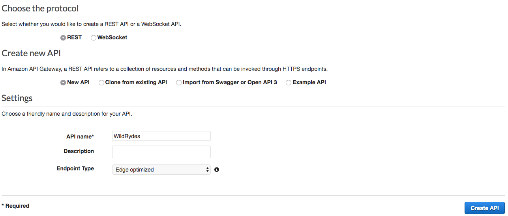
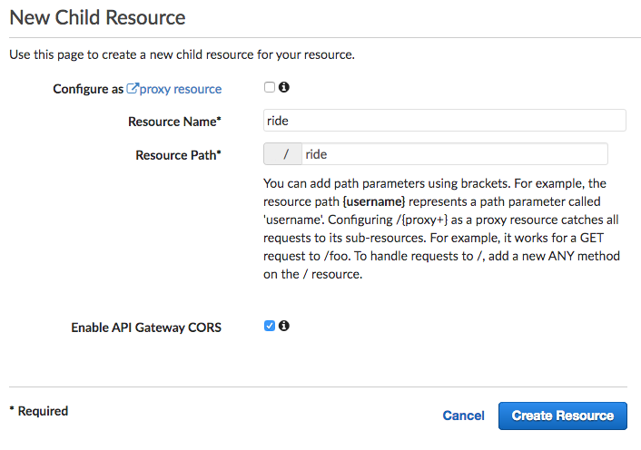
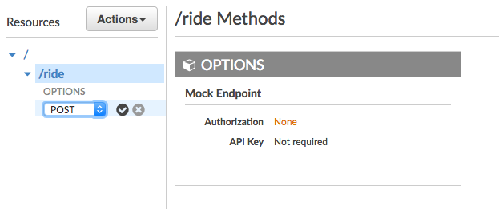

# Module 4: RESTful APIs with AWS Lambda and Amazon API Gateway

In this module we'll use API Gateway to expose the Lambda function that is built in the [previous module][serverless-backend] as a RESTful API. This API will be accessible on the public Internet. It will be secured using the Amazon Cognito user pool created in the [User Management][user-management] module. Using this configuration we will then turn the statically hosted website into a dynamic web application by adding client-side JavaScript that makes AJAX calls to the exposed APIs.


The diagram above shows how the API Gateway component we will build in this module integrates with the existing components built previously. The grayed out items are pieces have been already implemented in previous steps.

The static website deployed in the first module already has a page configured to interact with the API we'll build in this module. The page at /ride.html has a simple map-based interface for requesting a unicorn ride. After authenticating using the /signin.html page, the users will be able to select their pickup location by clicking a point on the map and then requesting a ride by choosing the "Request Unicorn" button in the upper right corner.

This module will focus on the steps required to build the cloud components of the API, To check how the browser code works that calls this API, inspect the [ride.js](../1_StaticWebHosting/website/js/ride.js) file of the website. In this case the application uses jQuery's [ajax()](https://api.jquery.com/jQuery.ajax/) method to make the remote request.

## Implementation Instructions

:heavy_exclamation_mark: Ensure we've completed the [Serverless Backend][serverless-backend] step before beginning
the workshop.

Each of the following sections provides an implementation overview and detailed, step-by-step instructions. The overview should provide enough context to complete the implementation.

### 1. Create a New REST API
Use the Amazon API Gateway console to create a new API named `WildRydes`.

**Step-by-step directions**
1. Go to the [Amazon API Gateway Console][api-gw-console]
1. Choose **Create API**.
1. Select **REST**, **New API** and enter `WildRydes` for the **API Name**.
1. Select `Edge optimized` from the **Endpoint Type** dropdown.
    ***Note***: Edge optimized are best for public services being accessed from the Internet. Regional endpoints are typically used for APIs that are accessed primarily from within the same AWS Region. Private APIs are for internal services inside of an Amazon VPC.
1. Choose **Create API**

    

### 2. Create a Cognito User Pools Authorizer

#### Background
Amazon API Gateway can use the JWT tokens returned by Cognito User Pools to authenticate API calls. In this step we'll configure an authorizer for the API to use the user pool that is created in [User Management][user-management].

#### High-Level Instructions
In the Amazon API Gateway console, create a new Cognito user pool authorizer for the created API. Configure it with the details of the user pool that is created in the previous module. Test the configuration in the console by copying and pasting the auth token that is retrievd after loggin in via the /signin.html page of the current website.

**Step-by-step directions**
1. Under the newly created API, choose **Authorizers**.
1. Choose **Create New Authorizer**.
1. Enter `WildRydes` for the Authorizer name.
1. Select **Cognito** for the type.
1. In the Region drop-down under **Cognito User Pool**, select the Region where we  have created the Cognito user pool in the User Management module (
1. Enter `WildRydes`in the **Cognito User Pool** input.
1. Enter `Authorization` for the **Token Source**.
1. Choose **Create**.

    

#### Verify your authorizer configuration

**Step-by-step directions**
1. Open a new browser tab and visit `/ride.html` under the website's domain.
1. If redirected to the sign-in page, sign in with the user that is created in the last module. Now we are Redirected back to `/ride.html`.
1. Copy the auth token from the notification on the `/ride.html`,
1. Go back to previous tab where we have just finished creating the Authorizer
1. Click **Test** at the bottom of the card for the authorizer.
1. Paste the auth token into the **Authorization Token** field in the popup dialog.
    

1. Click **Test** button and verify that the response code is 200 and see the claims for the user displayed.

### 3. Create a new resource and method
Create a new resource called /ride within the designed API. Then create a POST method for that resource and configure it to use a Lambda proxy integration backed by the RequestUnicorn function that is created in the first step of this module.

**Step-by-step directions**
1. In the left nav, click on **Resources** under the WildRydes API.
1. From the **Actions** dropdown select **Create Resource**.
1. Enter `ride` as the **Resource Name**.
1. Ensure the **Resource Path** is set to `ride`.
1. Select **Enable API Gateway CORS** for the resource.
1. Click **Create Resource**.

    

1. With the newly created `/ride` resource selected, from the **Action** dropdown select **Create Method**.
1. Select `POST` from the new dropdown that appears, then **click the checkmark**.

    
1. Select **Lambda Function** for the integration type.
1. Check the box for **Use Lambda Proxy integration**.
1. Select the Region which is being used **Lambda Region**.
1. Enter the name of the function that is created in the previous module, `RequestUnicorn`, for **Lambda Function**.
1. Choose **Save**.

    

1. When prompted to give Amazon API Gateway permission to invoke the lambda function, choose **OK**.
1. Choose on the **Method Request** card.
1. Choose the pencil icon next to **Authorization**.
1. Select the WildRydes Cognito user pool authorizer from the drop-down list, and click the checkmark icon.

    

### 4. Deploy API
From the Amazon API Gateway console, choose Actions, Deploy API. we'll be prompted to create a new stage. Use prod for the stage name.

**Step-by-step directions**
1. In the **Actions** drop-down list select **Deploy API**.
1. Select **[New Stage]** in the **Deployment stage** drop-down list.
1. Enter `prod` for the **Stage Name**.
1. Choose **Deploy**.
1. Note the **Invoke URL**. This required in the next session.

### 5. Update the Website Config
Update the /js/config.js file in the website deployment to include the invoke URL of the stage is just created.Copy the invoke URL directly from the top of the stage editor page on the Amazon API Gateway console and paste it into the \_config.api.invokeUrl key of the sites /js/config.js file. Make sure when to update the config file it still contains the updates that are made in the previous module for previously created Cognito user pool.

**Step-by-step directions**
1. On the Cloud9 development environment open `js/config.js`
1. Update the **invokeUrl** setting under the **api** key in the config.js file. Set the value to the **Invoke URL** for the deployment stage that is created in the previous section.
    An example of a complete `config.js` file is included below.
    ```JavaScript
    window._config = {
        cognito: {
            userPoolId: 'us-west-2_uXboG5pAb', // e.g. us-east-2_uXboG5pAb
            userPoolClientId: '25ddkmj4v6hfsfvruhpfi7n4hv', // e.g. 25ddkmj4v6hfsfvruhpfi7n4hv
            region: 'us-west-2' // e.g. us-east-2
        },
        api: {
            invokeUrl: 'https://rc7nyt4tql.execute-api.us-west-2.amazonaws.com/prod' // e.g. https://rc7nyt4tql.execute-api.us-west-2.amazonaws.com/prod,
        }
    };
    ```

1. Save the modified file making sure the filename is still `config.js`.
1. Commit the changes to attached git repository:
    ```
    $ git add js/config.js 
    $ git commit -m "configure api invokeURL"
    $ git push
    ...
    Counting objects: 4, done.
    Compressing objects: 100% (4/4), done.
    Writing objects: 100% (4/4), 422 bytes | 422.00 KiB/s, done.
    Total 4 (delta 3), reused 0 (delta 0)
    To https://git-codecommit.us-east-1.amazonaws.com/v1/repos/wildrydes-site
       c15d5d5..09f1c9a  master -> master
    ```

    [Amplify Console][amplify-console-console] should pick up the changes and begin building and deploying the web application. Watch it to verify the completion of the deployment.

## Implementation Validation

**Step-by-step directions**
1. Visit `/ride.html` under the website domain.
1. If redirected to the sign in page, sign in with the user created in the previous module.
1. After the map has loaded, click anywhere on the map to set a pickup location.
1. Choose **Request Unicorn**. Observe a notification in the right sidebar that a unicorn is on its way and then see a unicorn icon fly to the designated pickup location.

### Module Recap

This module showcases the robustness of Amazon API gateway.
In summery, [Amazon API Gateway][api-gw] is a fully managed service that makes it easy for developers to create, publish, maintain, monitor, and secure APIs at any scale. You can easily plug in Authorization via [Amazon Cognito][cognito] and backends such as [AWS Lambda][lambda] to create completely serverless APIs.

In this module we've used API Gateway to provide a REST API to the Lambda function created in the previous module. From there we've updated the website to use the API endpoint so that user can request rides and the information about the ride is saved in the DynamoDB table created earlier.

:star: With this we have completed the Wild Rydes Web Application project. This project was completed and implemented by one person team hence which it is kept as short and concise as possible so as to not over commit and underdeliver. This project accurately showcases the different functionalities, robustness and efficiency of AWS Cloud technologoies.

### Next

See the [cleanup guide][cleanup] for instructions on how to delete the resources we've created. As this is project was done using the free account it is importanat that we clear the resources.

[amplify-console]: https://aws.amazon.com/amplify/console/
[amplify-console-console]: https://console.aws.amazon.com/amplify/home
[api-gw]: https://aws.amazon.com/api-gateway/
[api-gw-console]: https://console.aws.amazon.com/apigateway/home
[cleanup]: ../5_CleanUp/
[cognito-console]: https://console.aws.amazon.com/cognito/home
[cognito]: https://aws.amazon.com/cognito/
[configjs]: ../1_StaticWebHosting/website/js/config.js
[dynamodb-console]: https://console.aws.amazon.com/dynamodb/home
[dynamodb]: https://aws.amazon.com/dynamodb/
[iam-console]: https://console.aws.amazon.com/iam/home
[jwt-decoder]: https://jwt.io/
[lambda-console]: https://console.aws.amazon.com/lambda/home
[lambda]: https://aws.amazon.com/lambda/
[restful-apis]: ../4_RESTfulAPIs/
[serverless-backend]: ../3_ServerlessBackend/
[setup]: ../0_Setup/
[static-web-hosting]: ../1_StaticWebHosting/
[user-management]: ../2_UserManagement/
